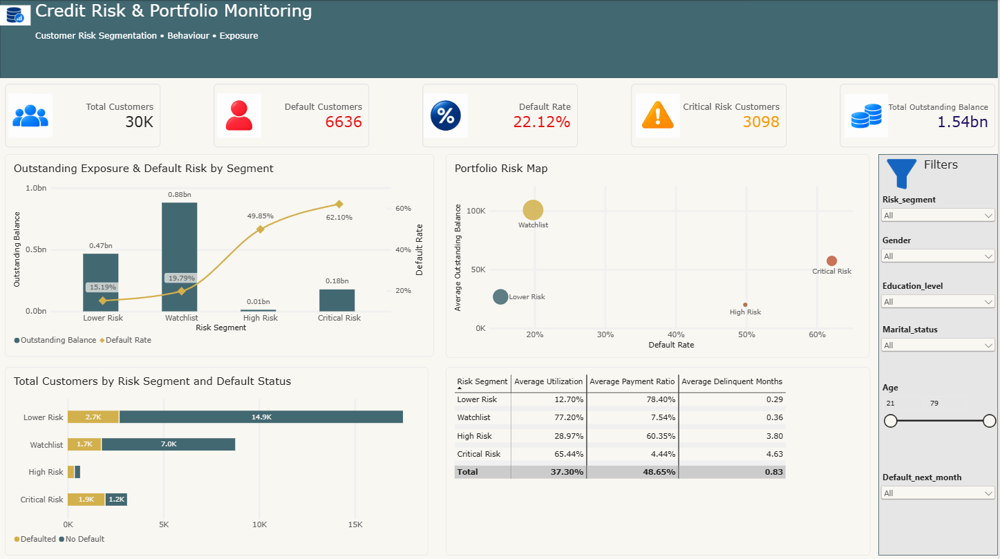

# Credit Risk & Portfolio Monitoring

**Author:** Akash Kaliramna
**Tools Used:** MySQL · SQL (CTEs, window functions, CASE logic, conditional aggregation) · Power BI Desktop · DAX

---

## Project Overview

For this project I took on the role of a Data Analyst supporting a credit-card issuer's Credit Risk / Portfolio Management team. The bank has historical data on 30,000 customers — their granted credit, demographics, and six months of billing, payment, and repayment behaviour — and wants to understand where default risk is concentrated across its portfolio before deciding where to focus monitoring and intervention.

I deliberately did **not** frame this as a machine-learning prediction project. Building a model that scores a *new* applicant's probability of default is a different problem, one this dataset and timeline weren't set up to answer credibly. Instead, I built an analyst workflow: profile the raw data, engineer behavioural features from the six months of repayment history, test which behaviours actually associate with default, build a defensible risk segmentation from the evidence, and quantify how much money the bank has at stake in each segment.

**Key findings at a glance:**
- 22.12% overall default rate across 30,000 customers
- Persistent delinquency (3+ of 6 months) is the strongest behavioural signal — default rate climbs from 11.71% to 70.32% as delinquent months go from 0 to 6
- An equal-weight risk score was tested and rejected once diagnostics showed the underlying factors weren't equally predictive
- Final segmentation: Lower Risk (15.19% default) → Watchlist (19.79%) → High Risk (49.85%) → Critical Risk (62.10%)
- **The Watchlist, not Critical Risk, carries the largest share of outstanding exposure (57.3%, ~880M)** — the project's central insight

<p align="center">
  
</p>

---

## Business Task

> **Which customer and repayment-behaviour patterns are associated with higher default risk, where is the bank's credit exposure concentrated, and which customer segments should receive greater risk-management attention?**

**Primary stakeholder:** the Credit Risk Manager, who needs three things from this analysis:

- **Risk** — where is default most prevalent?
- **Behaviour** — what repayment patterns are associated with default?
- **Exposure** — where has the bank granted (and where is currently outstanding) significant credit to customers displaying higher-risk behaviour?

One framing decision mattered a lot here: I use the word *associated with* default throughout, never *causes*. This is observational data — it can reveal relationships, but it can't prove that a given behaviour causes default. I also deliberately kept demographics (age, gender, education, marital status) as *descriptive* context rather than the basis for any risk decision. The segmentation you'll see below is built entirely from financial and repayment behaviour, not who the customer is.

---

## Data Source

**UCI Machine Learning Repository — Default of Credit Card Clients**
[https://archive.ics.uci.edu/dataset/350/default+of+credit+card+clients](https://archive.ics.uci.edu/dataset/350/default%2Bof%2Bcredit%2Bcard%2Bclients)

- 30,000 Taiwanese credit-card customers, 25 columns (ID, 23 features, 1 target)
- Six months of repayment status, bill statements, and payment amounts (April–September 2005)
- Target: whether the customer defaulted the following month (1/0)
- Credit values are in NT dollars; UCI reports no missing values
- Licensed CC BY 4.0 — safe to use and publish for a portfolio project

---

## Repository Structure

```
credit-risk-portfolio-analysis/
│
├── README.md                                         ← You are here
├── Credit_Risk_Portfolio_Project_Documentation.docx  ← Full detailed report
├── credit_risk_analysis_full.sql                     ← Complete reproducible SQL workflow
├── Credit-Risk-Portfolio-Monitoring.pbix              ← Power BI Desktop file
│
└── assets/
    └── dashboard.png
```

---

## Tools & Workflow

| Phase | Tool | Purpose |
|---|---|---|
| Import | MySQL / MySQL Workbench | Load the raw UCI export into a database, untouched |
| Profile | SQL | Understand what's actually in the data before touching it |
| Clean & transform | SQL | Build a readable, analysis-ready customer table without discarding anything unexplained |
| Analyze | SQL (CTEs, window functions, CASE) | Test which behaviours associate with default; build and validate a risk segmentation |
| Report | Power BI + DAX | Turn the SQL findings into an executive dashboard |

**Why MySQL first, Power BI second?** I wanted the business logic — the segmentation rules, the behavioural features, the exposure definitions — to live in one place I could test and validate, not scattered across DAX measures and Power Query steps. Power BI connects to a single final SQL view; it never redefines what a "Critical Risk" customer is.

---

## Step 1 — Profiling the Raw Data

Before cleaning anything, I imported the raw UCI export into a `credit_card_clients_raw` table and left it untouched for the rest of the project — an auditable source layer I could always compare back to.

Then I profiled it, column by column, specifically looking for things that *looked* wrong but might not actually be errors:

```sql
SELECT EDUCATION, COUNT(*) AS customers
FROM credit_card_clients_raw
GROUP BY EDUCATION
ORDER BY EDUCATION;
```

UCI documents `EDUCATION` codes 1–4, but the data also contained codes 0, 5, and 6 — about 345 customers (1.15%). Same story with `MARRIAGE`: documented codes are 1–3, but 54 customers had code 0. I didn't delete these records or guess what the undocumented codes meant. I grouped them as `Other/Unknown` and kept every customer.

I ran the same "check before you touch it" discipline on the numeric fields:

```sql
SELECT
    MIN(LIMIT_BAL) AS min_credit_limit, MAX(LIMIT_BAL) AS max_credit_limit,
    MIN(AGE) AS min_age, MAX(AGE) AS max_age,
    MIN(BILL_AMT1) AS min_sep_bill, MAX(BILL_AMT1) AS max_sep_bill
FROM credit_card_clients_raw;
```

This turned up two things that looked alarming at first glance but weren't errors: **negative bill balances** (customers who overpaid or had a credit balance) and **over-limit balances** — I found 3,931 customers (about 13% of the portfolio) whose bill exceeded their credit limit in at least one of the six months. That's a different measure from the six-month *average* utilization I calculate later in the utilization analysis, where 637 customers averaged 100%+ utilization across the full window — a single bad month is more common than a persistently maxed-out account, which is exactly what you'd expect. Both are legitimate account behaviours, not data-quality problems, so I kept every one of these records. In fact, the over-limit customers turned out to be an analytically interesting group later on.

Also checked: 0 duplicate customer IDs, 0 NULLs across all 25 columns, and a clean binary target (`default payment next month`) with no unexpected values. The dataset's actual quality issues turned out to be narrow — a small number of undocumented demographic category codes and two undocumented repayment-status codes — not the sprawling mess I'd braced for.

---

## Step 2 — Cleaning & Transformation

With the profiling done, I built a separate `credit_card_clients_clean` table rather than modifying the raw one — same principle as the raw layer: keep an auditable trail.

```sql
CREATE TABLE credit_card_clients_clean AS
SELECT
    CAST(ID AS UNSIGNED) AS customer_id,
    CAST(LIMIT_BAL AS DECIMAL(14,2)) AS credit_limit,
    CASE WHEN SEX = 1 THEN 'Male' WHEN SEX = 2 THEN 'Female' ELSE 'Unknown' END AS gender,
    CASE WHEN EDUCATION = 1 THEN 'Graduate School'
         WHEN EDUCATION = 2 THEN 'University'
         WHEN EDUCATION = 3 THEN 'High School'
         ELSE 'Other/Unknown' END AS education_level,
    CASE WHEN MARRIAGE = 1 THEN 'Married'
         WHEN MARRIAGE = 2 THEN 'Single'
         ELSE 'Other/Unknown' END AS marital_status,
    -- repayment status, bill amounts, and payment amounts renamed to readable month labels
    CAST(`default payment next month` AS UNSIGNED) AS default_next_month
FROM credit_card_clients_raw;
```

The renaming matters more than it sounds like it should — `PAY_0`, `BILL_AMT1`, `PAY_AMT1` don't tell you anything at a glance. I renamed the repayment/bill/payment columns to `pay_status_sep`, `bill_amount_sep`, `payment_amount_sep` (and so on back to April), which made every query after this point self-explanatory without needing a data dictionary open in another tab.

Nothing was deleted. Every transformation decision is one I can defend: readable field names, undocumented codes grouped as Unknown rather than guessed at, negative balances and over-limit balances preserved because they're real account behaviour.

---

## Step 3 — SQL Analysis: Which Behaviours Actually Matter?

This is where the project moves from "clean data" to "answer the business question." I built each analysis one variable at a time, and each one motivated the next.

### 3.1 — Does the most recent repayment status predict default?

```sql
SELECT pay_status_sep, COUNT(*) AS total_customers,
       SUM(default_next_month) AS default_customers,
       ROUND(100.0 * SUM(default_next_month) / COUNT(*), 2) AS default_rate_pct
FROM credit_card_clients_clean
GROUP BY pay_status_sep
ORDER BY pay_status_sep;
```

Customers with a "no delinquency" September status defaulted at 12.81%. Customers one month late jumped to 33.95%. Two months late: 69.14%. That's a strong enough jump that I wanted to know: does it get even stronger if I look at the whole six-month window instead of just one snapshot?

### 3.2 — Multi-month delinquency (the strongest single finding)

I counted, per customer, how many of the six months had a delinquent status:

```sql
WITH customer_delinquency AS (
    SELECT customer_id, default_next_month,
        (pay_status_sep >= 1) + (pay_status_aug >= 1) + (pay_status_jul >= 1) +
        (pay_status_jun >= 1) + (pay_status_may >= 1) + (pay_status_apr >= 1) AS delinquent_months
    FROM credit_card_clients_clean
)
SELECT delinquent_months, COUNT(*) AS total_customers,
       ROUND(100.0 * SUM(default_next_month) / COUNT(*), 2) AS default_rate_pct
FROM customer_delinquency
GROUP BY delinquent_months
ORDER BY delinquent_months;
```

| Delinquent months | Customers | Default rate |
|---:|---:|---:|
| 0 | 19,931 | 11.71% |
| 1 | 4,426 | 29.82% |
| 2 | 1,899 | 38.76% |
| 3 | 1,154 | 50.87% |
| 4 | 951 | 57.31% |
| 5 | 298 | 57.38% |
| 6 | 1,341 | 70.32% |

Nearly monotonic, and roughly a 6× difference between the two ends. This became the backbone of everything that followed — every later analysis got tested against it.

### 3.3 — Does credit utilization matter too?

I calculated each customer's average six-month bill balance as a percentage of their credit limit, banded it, and checked default rate per band. Utilization ranged from -23% to over 500% of the limit (yes — some customers' average bill exceeded their credit limit by 5×), and I kept those extremes rather than capping them, since they're observed behaviour, not calculation errors.

| Utilization band | Customers | Default rate |
|---|---:|---:|
| <0% | 201 | 25.37% |
| 0–24% | 14,185 | 17.86% |
| 25–49% | 4,555 | 19.87% |
| 50–74% | 4,877 | 25.10% |
| 75–99% | 5,545 | 30.73% |
| 100%+ | 637 | 34.22% |

Real, but weaker than delinquency — roughly a 2× spread, not 6×. When I combined the two dimensions, delinquency dominated: customers with high utilization *and* no delinquency still only defaulted at 13.38%, barely above baseline, while low-utilization customers with persistent delinquency still hit 58.03%.

### 3.4 — What about how much they actually pay?

I defined a payment ratio (six-month total payments ÷ six-month total billed amount) and found something I didn't expect: the relationship wasn't a clean line. Default risk fell sharply from 26.98% (very low payment) down to 14.43% (moderate payment) — then flattened and even ticked back up slightly for high and very-high payment ratios. So I didn't force this into a simple "more payment = safer" story; I used it as a targeted risk modifier instead of a standalone score.

Worth being precise about what this ratio actually measures: it's an analytical behavioural proxy based on monthly statement balances and payments, not a formal cash-flow repayment rate. Statement balances can carry forward across months, so this shouldn't be read as "percentage of original debt repaid" — it's a consistent, comparable signal across customers, not an accounting measure.

---

## Step 4 — The Hypothesis I Tested and Rejected

At this point I had three behavioural signals — persistent delinquency, high utilization, very-low payment ratio — and the obvious next move was to combine them into a simple score: one point each, sum from 0 to 3. It looked good at first: default rate climbed cleanly from 14.11% (no flags) to 61.72% (all three flags).

| Risk score | Customers | Default rate |
|---:|---:|---:|
| 0 | 12,137 | 14.11% |
| 1 | 6,221 | 17.38% |
| 2 | 8,416 | 25.49% |
| 3 | 2,155 | 61.72% |

But I didn't stop there, because a score that *looks* clean can still be hiding something. I broke the score down into its eight individual flag combinations, and that's where it fell apart:

| Flags present | Customers | Default rate |
|---|---:|---:|
| Persistent delinquency **only** | 484 | 48.55% |
| High utilization **only** | 1,431 | 18.52% |
| Very low payment **only** | 4,306 | 13.49% |
| Delinquency + very low payment | 943 | 62.99% |
| Delinquency + high utilization | 157 | 54.14% |
| All three | 2,155 | 61.72% |

Two customers who both scored "1" could have wildly different actual risk — 48.55% versus 13.49% — depending on *which* flag they had. Equal weighting was hiding that difference. Notice too that very-low-payment-alone (13.49%) sat *below* the no-flag baseline (14.11%) — its apparent earlier effect was mostly overlap with delinquency, not an independent signal.

**I rejected the equal-weight score.** Persistent delinquency is clearly the dominant factor; utilization and payment ratio matter, but mainly as modifiers on top of delinquency status, not as equal partners in a point system.

---

## Step 5 — Building the Final Risk Segmentation From Evidence

Instead of inventing new weights, I built the segmentation directly from the empirical break the diagnostic revealed: default rates jumped from the 13–20% range (no persistent delinquency) to the 49–63% range (persistent delinquency present) — a much cleaner dividing line than any point score.

```sql
CASE
    WHEN delinquent_months >= 3 AND payment_ratio_pct < 10 THEN 'Critical Risk'
    WHEN delinquent_months >= 3                            THEN 'High Risk'
    WHEN delinquent_months < 3 AND avg_utilization_pct >= 50 THEN 'Watchlist'
    ELSE 'Lower Risk'
END
```

| Risk segment | Customers | Defaults | Default rate |
|---|---:|---:|---:|
| Lower Risk | 17,509 | 2,659 | 15.19% |
| Watchlist | 8,747 | 1,731 | 19.79% |
| High Risk | 646 | 322 | 49.85% |
| Critical Risk | 3,098 | 1,924 | 62.10% |

I froze this definition at this point and didn't revisit it later, even when it would've been tempting to nudge a threshold for a cleaner-looking chart. Once you start adjusting rules to make the output prettier, you're no longer measuring anything real.

---

## Step 6 — Where Is the Money? (Exposure Analysis)

Knowing who's risky isn't the whole answer for a bank — a segment can have a scary default rate and still not matter much if there's little money behind it. So I measured **outstanding balance** (the customer's positive September statement balance — negative/zero balances aren't money currently owed, so I excluded them from this specific metric) per segment:

| Risk segment | Customers | Outstanding balance | Avg / customer |
|---|---:|---:|---:|
| Lower Risk | 17,509 | 466,646,833 | 26,651.83 |
| Watchlist | 8,747 | 880,412,963 | 100,653.13 |
| High Risk | 646 | 12,848,281 | 19,888.98 |
| Critical Risk | 3,098 | 177,473,180 | 57,286.37 |

Validated portfolio total: **1,537,381,257** (~1.54bn).

This is the finding I'd lead with in an interview: **the Watchlist — not Critical Risk — carries the largest share of the bank's outstanding balance (57.3%) and the highest average balance per customer.** Critical Risk has by far the scariest default rate, but it's a smaller, lower-balance group. A monitoring process built purely around default-rate ranking would under-prioritize exactly the segment holding the most money.

(Getting to this number wasn't clean the first time. Two separate issues showed up along the way: one draft query used segmentation logic that had drifted from the frozen definitions, which I caught and corrected before ever running it; separately, an early exposure calculation — run before the final reporting view existed — produced segment totals that summed to roughly double the real portfolio balance. I never pinned down the exact cause of that second one with certainty, so rather than guess, I re-verified every number directly against the finished `vw_credit_risk_analysis` view and cross-checked the total against an independently calculated figure from the original balance diagnostic before trusting it. Both numbers matched exactly, which is what's reported above. Always verify an aggregate against a second, independent number before you build a headline finding on top of it.)

---

## Step 7 — One Reporting View, So Power BI Never Redefines the Business Logic

Once the segmentation and exposure logic were locked, I built one customer-level view for Power BI to read from:

```sql
CREATE VIEW vw_credit_risk_analysis AS
-- reuses the exact frozen delinquent_months, avg_utilization_pct,
-- payment_ratio_pct, outstanding_balance, and risk_segment logic
SELECT customer_id, gender, age, education_level, marital_status, credit_limit,
       default_next_month, delinquent_months, avg_utilization_pct, payment_ratio_pct,
       outstanding_balance, risk_segment
FROM segmented;
```

Deliberately excluded the eighteen individual monthly bill/payment/repayment columns — those already did their job engineering the behavioural features in SQL. Including them in Power BI would just tempt re-deriving the same logic differently in DAX, which is exactly how a dashboard's numbers end up disagreeing with the SQL underneath it.

---

## Power BI: Turning the Analysis Into a Dashboard

Power BI connects to MySQL in **Import mode** and reads only `vw_credit_risk_analysis`. I added one small `Risk Segments` dimension table purely to control display order (Lower Risk → Watchlist → High Risk → Critical Risk) since Power BI would otherwise sort alphabetically or by underlying value. `Risk Segments[Risk Segment]` has a one-to-many relationship with `vw_credit_risk_analysis[risk_segment]`, filtering in a single direction, and the dimension table's `Risk Segment` column is sorted by its `Sort Order` column.

Core DAX measures:

```DAX
Total Customers = DISTINCTCOUNT('vw_credit_risk_analysis'[customer_id])

Default Customers =
CALCULATE([Total Customers], 'vw_credit_risk_analysis'[default_next_month] = 1)

Default Rate = DIVIDE([Default Customers], [Total Customers])

Total Outstanding Balance = SUM('vw_credit_risk_analysis'[outstanding_balance])

Critical Risk Customers =
CALCULATE([Total Customers], 'vw_credit_risk_analysis'[risk_segment] = "Critical Risk")

Average Delinquent Months = AVERAGE('vw_credit_risk_analysis'[delinquent_months])

Average Payment Ratio = AVERAGE('vw_credit_risk_analysis'[payment_ratio_pct]) / 100

Average Utilization = AVERAGE('vw_credit_risk_analysis'[avg_utilization_pct]) / 100

Average Outstanding Balance = DIVIDE([Total Outstanding Balance], [Total Customers])
```

One formatting lesson worth mentioning: `avg_utilization_pct` and `payment_ratio_pct` are already stored as percentage points in SQL (62.42 means 62.42%). Applying Power BI's native Percentage format on top would have multiplied by 100 again and shown 6,242%. I kept those columns as plain decimals and built dedicated DAX measures (dividing by 100) for the one or two visuals that genuinely needed native percentage formatting.

### The dashboard

- **Five KPI cards:** Total Customers (30K), Default Customers (6,636), Default Rate (22.12%), Critical Risk Customers (3,098), Total Outstanding Balance (1.54bn)
- **Outstanding Exposure & Default Risk by Segment** — a combo chart (bars for balance, line for default rate) that immediately shows exposure and default probability aren't the same story
- **Portfolio Risk Map** — a bubble chart (X = default rate, Y = average balance per customer, size = total exposure) that puts the Watchlist-vs-Critical distinction in one glance
- **Customer Distribution by Risk Segment and Default Status** — stacked bars adding volume context to the rate-based charts
- **Behavioural Risk Scorecard** — average utilization, payment ratio, and delinquent months side-by-side across the four segments
- **Slicers** built from real fields only: Risk Segment, Gender, Education Level, Marital Status, Age, Default Next Month

---

## Top Recommendations

**1. Monitor exposure alongside default probability, not instead of it.** Critical Risk has the highest default rate (62.10%), but the Watchlist holds the largest outstanding balance (880.4M, 57.3% of the portfolio) and the highest average balance per customer. A monitoring process ranked only by default rate would under-prioritize the segment actually holding the most money at risk.

**2. Make persistent delinquency the first screening layer.** It was the dominant driver in every test I ran — customers delinquent all six months defaulted at 70.32%, roughly six times the rate of customers with none. Repayment-history checks should come before utilization or payment-ratio checks, not alongside them.

**3. Use utilization as a secondary stratifier, not a standalone trigger.** High-utilization customers with no delinquency still defaulted at only 13.38% — close to baseline. Utilization is most useful for splitting an *already-delinquent* group into higher and lower urgency, not for flagging customers on its own.

**4. Treat very-low payment ratio as a delinquency amplifier.** On its own it barely moved the needle (13.49%, essentially baseline); paired with persistent delinquency it pushed default risk to 62.99%. Best used as an escalation signal for customers already flagged as delinquent.

---

## Challenges & Solutions

| Challenge | Solution |
|---|---|
| UCI documents `-1` as "pay duly" and `1–9` as months of delay, but does not define the `-2` and `0` codes also present in the data, and the raw Excel file's two-row header risked importing metadata as a customer record | Profiled the actual code distributions first, documented an explicit stated assumption for the two genuinely undocumented codes, and stripped the metadata row from the import copy while leaving the original file untouched |
| EDUCATION and MARRIAGE contained undocumented category codes | Investigated frequency and impact before deciding anything; grouped them as "Other/Unknown" rather than deleting rows or inventing a meaning |
| An equal-weight three-flag risk score looked clean in aggregate but was hiding very different risk levels underneath | Broke the score into its eight individual flag combinations, found the factors weren't equally predictive, and rebuilt the segmentation from the empirical break instead of an invented point system |
| A draft exposure query used segmentation logic that had drifted from the frozen definitions; separately, an early exposure calculation returned a portfolio total roughly double the real figure for reasons I couldn't fully confirm | Corrected the segmentation logic before running the drifted query; for the numeric discrepancy, re-verified every figure directly against the final reporting view and cross-checked the total against an independently calculated number rather than guess at the root cause |
| Power BI's default Percentage format would have misrepresented SQL columns already stored as percentage points | Kept those fields as plain decimals and built dedicated DAX measures for the visuals that specifically needed native percentage formatting |

---

## Limitations

- The dataset reflects Taiwanese credit-card customers and 2005 account behaviour — not a current market benchmark.
- The segmentation is descriptive and rule-based, built for portfolio monitoring, not a production underwriting model.
- No LGD/EAD assumptions exist in the source data, so no expected-loss figure was calculated.
- Undocumented category and repayment-status codes were preserved rather than assigned unsupported meanings.

---

## Full Report

For the complete methodology and the full reasoning behind each decision, see [`Credit_Risk_Portfolio_Project_Documentation.docx`](./Credit_Risk_Portfolio_Project_Documentation.docx). The full reproducible SQL workflow — including the profiling, validation, and diagnostic queries referenced throughout this README — is in [`credit_risk_analysis_full.sql`](./credit_risk_analysis_full.sql).

---

## Skills Demonstrated

MySQL · Advanced SQL (CTEs, window functions, CASE-based segmentation) · Data profiling & data-quality investigation · Data cleaning & transformation · Behavioural feature engineering · Hypothesis testing & diagnostic decomposition · Risk segmentation · Portfolio exposure analysis · Power BI · DAX · Data storytelling

---

## 👤 About

**Akash Kaliramna**
Data Analyst | SQL · Power BI · Python · Excel · Tableau
